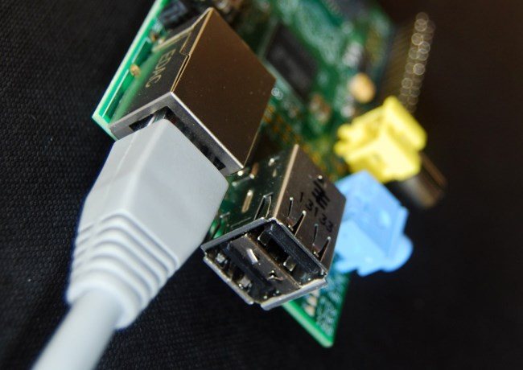

## 들어가며

이번 과정은 라즈베리 파이 네트워킹(networking) 소개과정으로 고안되었다.
이번 과정을 통해서 다양한 네트워크를 설정하고 사용할 것이며, 실습을 통해서 기본적인 네트워킹에 대해서도 학습할 것이다.

라즈베리파이 재단 공식 웹사이트 [RASPBERRY PI NETWORKING](https://www.raspberrypi.org/learning/networking-lessons/) 기반으로 학습을 시작한다.

## 네트워킹 과정을 통해서 다음을 배우게 됩니다.

- 두개 이상의 라즈베리 파이를 네트워크를 통해 연결해 통신하는 방법
- 한 라즈베리 파이 프로그램을 작성해서 또 다른 라즈베리 파이로 메시지를 전송하는 방법
- 네트워크를 통해서 하드웨어를 제어하는 방법
- 네트워크 설정하고 서버 구축하는 방법
- 기초 네트워킹 개념
    - IP 주소 (IP address)
    - 서버와 클라이언트 (Servers and Clients)
    - 동적 호스트 구성 프로토콜(Dynamic Host Configuration Protocol, DHCP)
    - 도메인 네임 시스템 (Domain Name System, DNS)

## 필요한 준비물

라즈베리 파이를 가진 학생 각각 혹은 짝을 지어 수행하는 것을 권장한다.
각 라즈베리 파이가 첫번째 학습에서 다른 학생 라즈베리 파이에 연결되어야 되어서 
짝수 라즈베리 파이가 필요하다. 각 학생 혹은 짝을 이룬 학생은 다음 기구물에 접근할 수 있어야 한다.

- 다음 환경 설정이 된 라즈베리 파이
    - 라즈비언 운영체제가 탑재된 최신 NOOBS SD 카드
    - `network.py`와 `thing-client.py` 파이썬 파일을 SD 카드에 복사한다.
    - 키보드, 마우스, 모니터(혹은 TV)
    - 두 라즈베리 파이를 연결하는 네트워크 케이블
    - 연결부분이 암놈-암놈 연결선 4개와 LED 1개 (두번째 수업용)

> ## 선수 과목
>
> [컴퓨터 과학 언플러그드](http://www.xwmooc.net/csunplugged/book.html)  
> [러플](http://rur-ple.xwmooc.net/)  
> [파이썬 거북이](http://swcarpentry.github.io/python-novice-turtles/index-kr.html)  

## 학습주제
		
1.  [네트워크를 통해 메시지 전송](01-sending-messages.html)
    - 사전에 동영상을 학습하고 수업에 참석한다.
2.  [네트워크로 하드웨어 제어](02-controlling-hardware.html)
3.  [동적 호스트 구성 프로토콜](03-dhcp.html)
4.  [도메인 네임 시스템](04-dns.html)

## [번역 라이센스](license.html)

영어 원문과 동일한 라이센스가 [xwMOOC](http://xwmooc.net/)에서 작업한 한국어 번역 저작물에도 적용됩니다.

